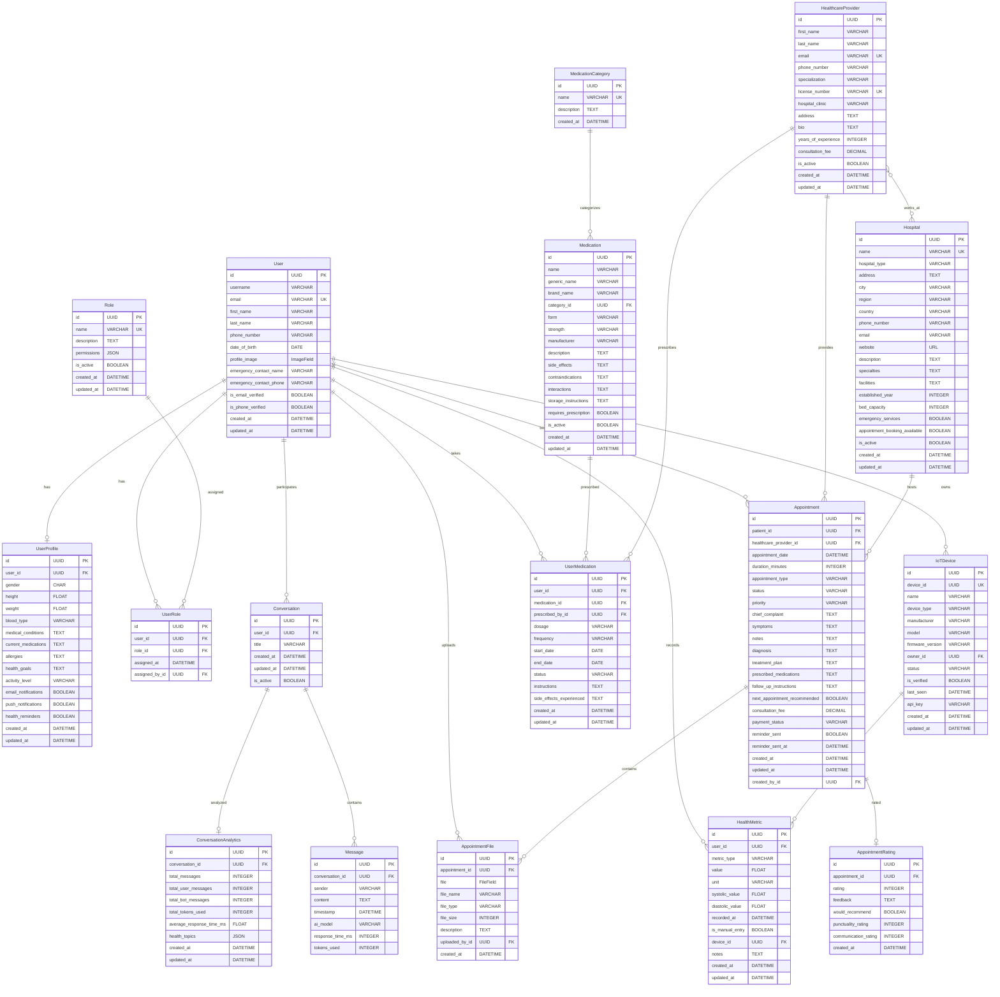
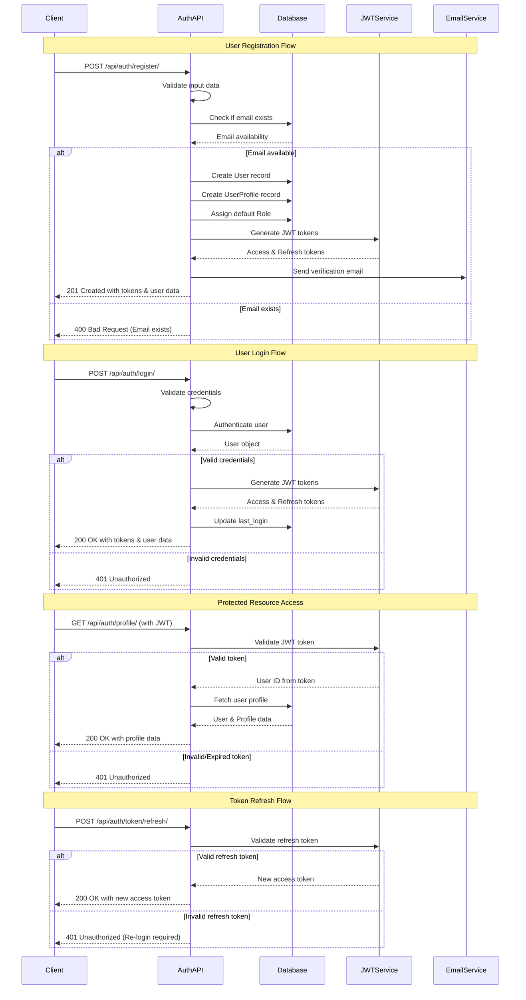
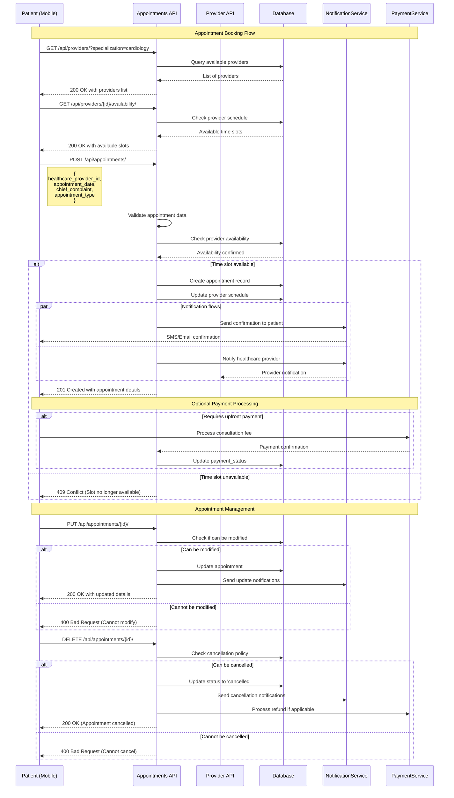
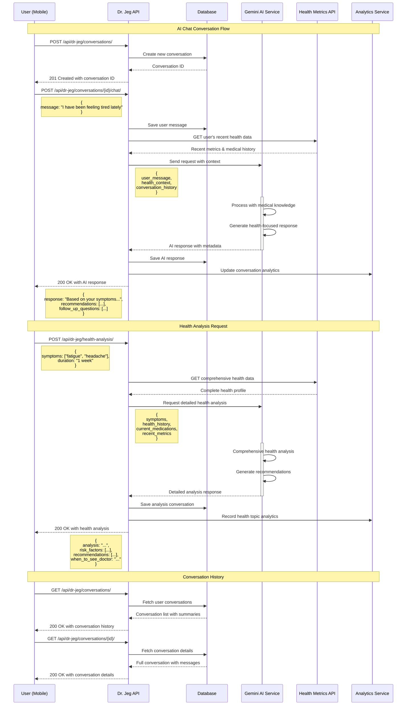
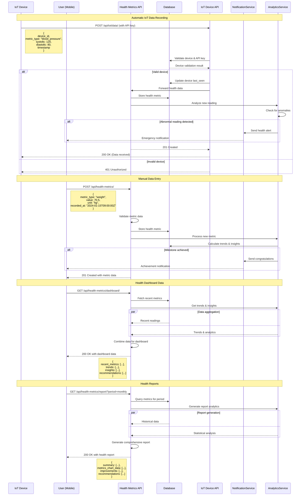
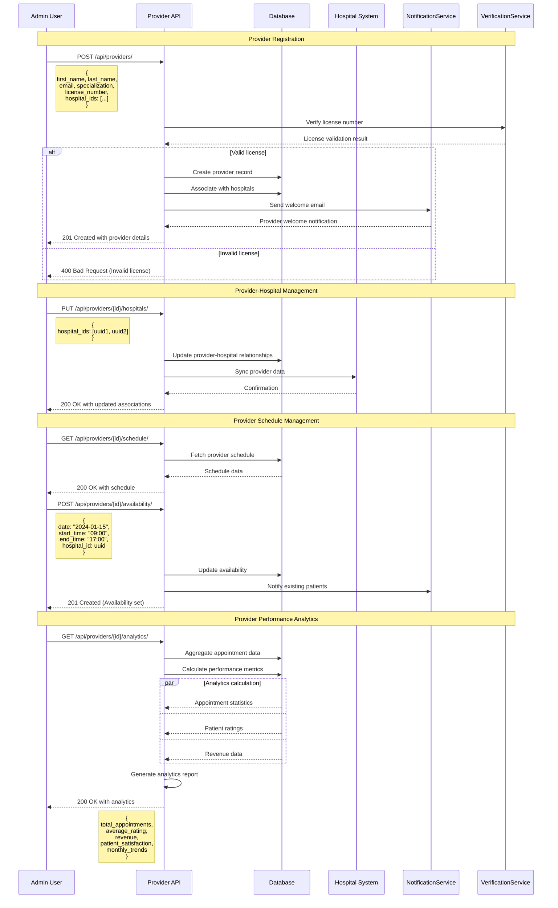
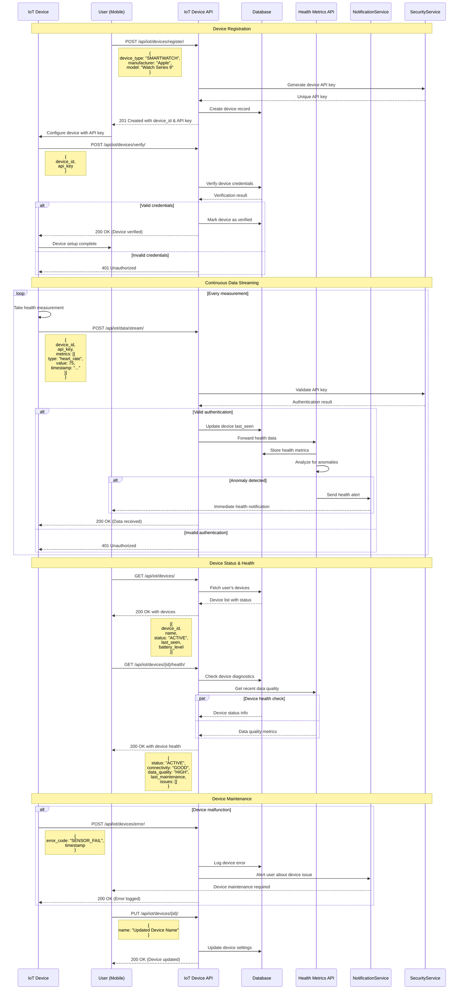
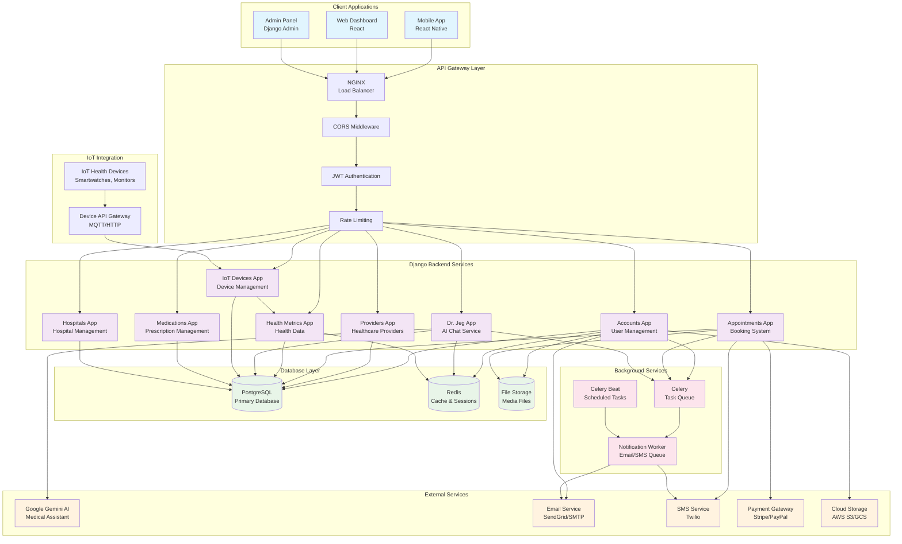
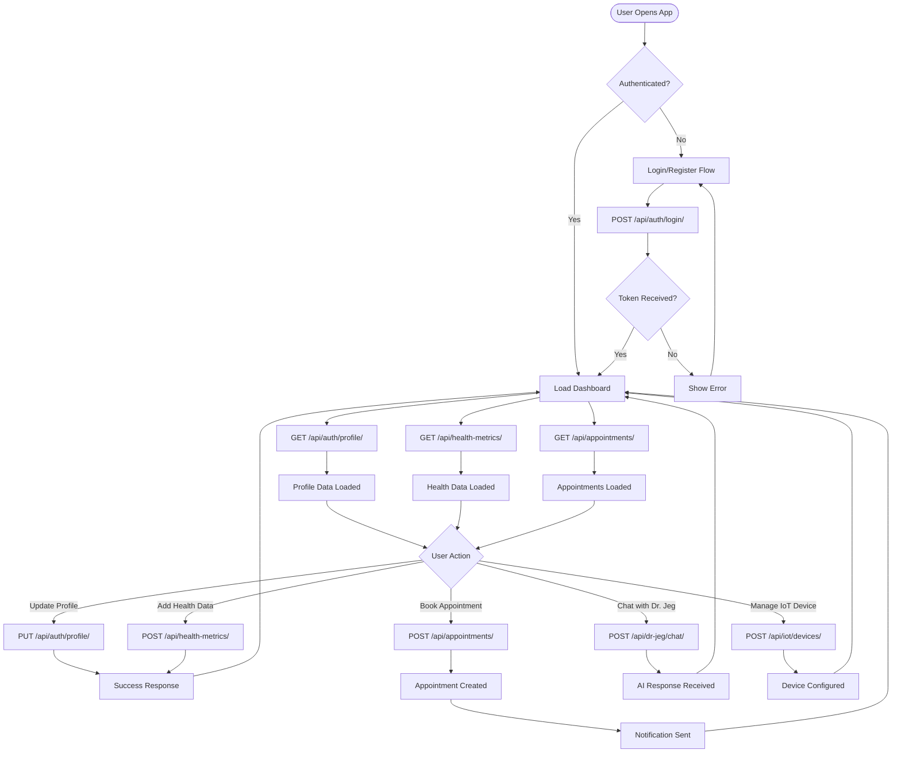

# JEGHealth Backend System Architecture Diagrams

This document contains comprehensive UML and sequence diagrams for the JEGHealth backend system, illustrating the relationships between models, API flows, and system interactions.

## Table of Contents
1. [Entity Relationship Diagram (ERD)](#entity-relationship-diagram-erd)
2. [Class Diagram - Core Models](#class-diagram---core-models)
3. [Authentication Flow Sequence Diagram](#authentication-flow-sequence-diagram)
4. [Appointment Booking Sequence Diagram](#appointment-booking-sequence-diagram)
5. [Dr. Jeg AI Chat Sequence Diagram](#dr-jeg-ai-chat-sequence-diagram)
6. [Health Metrics Recording Sequence Diagram](#health-metrics-recording-sequence-diagram)
7. [Provider Management Flow](#provider-management-flow)
8. [IoT Device Integration Flow](#iot-device-integration-flow)
9. [System Architecture Overview](#system-architecture-overview)

---

## Entity Relationship Diagram (ERD)



---

## Class Diagram - Core Models

```mermaid
classDiagram
    class User {
        +UUID id
        +String username
        +String email
        +String first_name
        +String last_name
        +String phone_number
        +Date date_of_birth
        +ImageField profile_image
        +String emergency_contact_name
        +String emergency_contact_phone
        +Boolean is_email_verified
        +Boolean is_phone_verified
        +DateTime created_at
        +DateTime updated_at
        +full_name() String
        +save()
    }
    
    class UserProfile {
        +UUID id
        +String gender
        +Float height
        +Float weight
        +String blood_type
        +Text medical_conditions
        +Text current_medications
        +Text allergies
        +Text health_goals
        +String activity_level
        +Boolean email_notifications
        +Boolean push_notifications
        +Boolean health_reminders
        +bmi() Float
    }
    
    class HealthcareProvider {
        +UUID id
        +String first_name
        +String last_name
        +String email
        +String phone_number
        +String specialization
        +String license_number
        +String address
        +Text bio
        +Integer years_of_experience
        +Decimal consultation_fee
        +Boolean is_active
        +full_name() String
        +hospital_names() String
        +primary_hospital() Hospital
        +get_hospitals_in_city(city) QuerySet
    }
    
    class Hospital {
        +UUID id
        +String name
        +String hospital_type
        +String address
        +String city
        +String region
        +String country
        +String phone_number
        +String email
        +String website
        +Text description
        +Text specialties
        +Text facilities
        +Integer established_year
        +Integer bed_capacity
        +Boolean emergency_services
        +Boolean appointment_booking_available
        +Boolean is_active
        +full_address() String
        +specialties_list() List
    }
    
    class Appointment {
        +UUID id
        +DateTime appointment_date
        +Integer duration_minutes
        +String appointment_type
        +String status
        +String priority
        +Text chief_complaint
        +Text symptoms
        +Text notes
        +Text diagnosis
        +Text treatment_plan
        +Text prescribed_medications
        +Text follow_up_instructions
        +Boolean next_appointment_recommended
        +Decimal consultation_fee
        +String payment_status
        +Boolean reminder_sent
        +DateTime reminder_sent_at
        +end_time() DateTime
        +is_past() Boolean
        +is_today() Boolean
        +is_upcoming() Boolean
        +can_be_cancelled() Boolean
        +can_be_rescheduled() Boolean
    }
    
    class HealthMetric {
        +UUID id
        +String metric_type
        +Float value
        +String unit
        +Float systolic_value
        +Float diastolic_value
        +DateTime recorded_at
        +Boolean is_manual_entry
        +Text notes
    }
    
    class IoTDevice {
        +UUID device_id
        +String name
        +String device_type
        +String manufacturer
        +String model
        +String firmware_version
        +String status
        +Boolean is_verified
        +DateTime last_seen
        +String api_key
        +generate_api_key() String
        +update_last_seen()
        +is_online() Boolean
    }
    
    class Conversation {
        +UUID id
        +String title
        +DateTime created_at
        +DateTime updated_at
        +Boolean is_active
        +save()
    }
    
    class Message {
        +UUID id
        +String sender
        +Text content
        +DateTime timestamp
        +String ai_model
        +Integer response_time_ms
        +Integer tokens_used
        +save()
    }
    
    %% Relationships
    User ||--|| UserProfile : profile
    User ||--o{ Appointment : patient
    User ||--o{ HealthMetric : metrics
    User ||--o{ IoTDevice : devices
    User ||--o{ Conversation : conversations
    
    HealthcareProvider ||--o{ Appointment : provider
    HealthcareProvider }o--o{ Hospital : hospitals
    
    Hospital ||--o{ Appointment : location
    
    IoTDevice ||--o{ HealthMetric : device
    
    Conversation ||--o{ Message : messages
```

---

## Authentication Flow Sequence Diagram



---

## Appointment Booking Sequence Diagram



---

## Dr. Jeg AI Chat Sequence Diagram



---

## Health Metrics Recording Sequence Diagram



---

## Provider Management Flow



---

## IoT Device Integration Flow



---

## System Architecture Overview



---

## API Interaction Flow



---

## Deployment Architecture

```mermaid
graph TB
    subgraph "Production Environment"
        subgraph "Load Balancer"
            LB[NGINX Load Balancer<br/>SSL Termination]
        end
        
        subgraph "Application Servers"
            App1[Django App Server 1<br/>Gunicorn + Django]
            App2[Django App Server 2<br/>Gunicorn + Django]
            App3[Django App Server 3<br/>Gunicorn + Django]
        end
        
        subgraph "Database Cluster"
            DBMaster[(PostgreSQL Master<br/>Read/Write)]
            DBSlave1[(PostgreSQL Slave 1<br/>Read Only)]
            DBSlave2[(PostgreSQL Slave 2<br/>Read Only)]
        end
        
        subgraph "Cache & Session Store"
            RedisCluster[(Redis Cluster<br/>Cache + Sessions)]
        end
        
        subgraph "Background Processing"
            CeleryWorker1[Celery Worker 1<br/>Background Tasks]
            CeleryWorker2[Celery Worker 2<br/>Background Tasks]
            CeleryBeat[Celery Beat<br/>Scheduler]
            RedisBroker[(Redis Broker<br/>Task Queue)]
        end
        
        subgraph "File Storage"
            S3[AWS S3<br/>Static Files & Media]
            CDN[CloudFront CDN<br/>Global Distribution]
        end
        
        subgraph "Monitoring & Logging"
            Prometheus[Prometheus<br/>Metrics Collection]
            Grafana[Grafana<br/>Dashboards]
            ELK[ELK Stack<br/>Centralized Logging]
        end
    end
    
    subgraph "External Services"
        GeminiAPI[Google Gemini AI]
        SendGrid[SendGrid Email]
        Twilio[Twilio SMS]
        Stripe[Stripe Payments]
    end
    
    Internet([Internet]) --> LB
    LB --> App1
    LB --> App2
    LB --> App3
    
    App1 --> DBMaster
    App1 --> DBSlave1
    App2 --> DBMaster
    App2 --> DBSlave2
    App3 --> DBMaster
    App3 --> DBSlave1
    
    App1 --> RedisCluster
    App2 --> RedisCluster
    App3 --> RedisCluster
    
    App1 --> RedisBroker
    App2 --> RedisBroker
    App3 --> RedisBroker
    
    RedisBroker --> CeleryWorker1
    RedisBroker --> CeleryWorker2
    CeleryBeat --> RedisBroker
    
    App1 --> S3
    App2 --> S3
    App3 --> S3
    S3 --> CDN
    
    App1 --> GeminiAPI
    App1 --> SendGrid
    App1 --> Twilio
    App1 --> Stripe
    
    App1 --> Prometheus
    App2 --> Prometheus
    App3 --> Prometheus
    Prometheus --> Grafana
    
    App1 --> ELK
    App2 --> ELK
    App3 --> ELK
    
    DBMaster --> DBSlave1
    DBMaster --> DBSlave2
    
    classDef server fill:#e3f2fd
    classDef database fill:#e8f5e8
    classDef external fill:#fff3e0
    classDef monitoring fill:#fce4ec
    
    class App1,App2,App3,LB server
    class DBMaster,DBSlave1,DBSlave2,RedisCluster,RedisBroker database
    class GeminiAPI,SendGrid,Twilio,Stripe external
    class Prometheus,Grafana,ELK monitoring
```



---

## Notes

### Model Relationships Summary:
- **User**: Central entity with one-to-one profile and many roles
- **HealthcareProvider**: Many-to-many with hospitals, one-to-many with appointments
- **Appointment**: Links patients (users) with providers, includes files and ratings
- **HealthMetric**: Tracks user health data, can be linked to IoT devices
- **IoTDevice**: Belongs to users, generates health metrics
- **Conversation**: Dr. Jeg chat sessions with messages and analytics
- **Medication**: Can be prescribed to users through UserMedication

### Key Features Illustrated:
1. **Authentication System**: JWT-based with role management
2. **Healthcare Provider Management**: Multi-hospital affiliations
3. **Appointment System**: Complete booking, modification, and rating workflow
4. **AI Health Assistant**: Dr. Jeg with conversation management
5. **Health Metrics**: Manual entry and IoT device integration
6. **Medication Management**: Prescription and tracking system
7. **IoT Integration**: Device registration and data streaming
8. **Notification System**: Multi-channel communication

### Architecture Patterns:
- **Microservices-like Django Apps**: Each domain has its own app
- **RESTful API Design**: Standard HTTP methods and status codes
- **Event-driven Notifications**: Background task processing
- **Caching Strategy**: Redis for performance optimization
- **Scalable Deployment**: Load-balanced application servers
- **Security**: JWT authentication, API key validation for IoT devices

This documentation provides a comprehensive view of the JEGHealth backend system architecture, suitable for developers, system administrators, and stakeholders to understand the system design and interactions.
